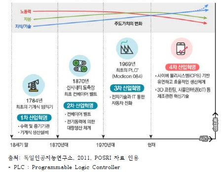
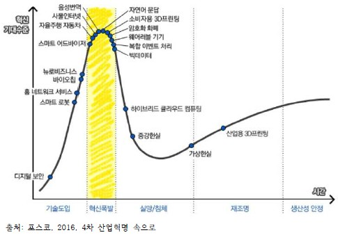

# 4차 산업혁명의 도래

## 4차 산업혁명의 개념
- 3차 산업혁명을 기반으로 하여 디지털, 생물학, 물리학 등의 경계가 없어지고 융합되는 기술혁명.
- 인터넷을 통해 모아진 인간의 행위와 생각을 온라인상의 거대한 데이터 저장고에 넣어 활용하는 일련의 경제적 활동.  

## 4차 산업혁명의 특징
| 구분 | 설명 |
| --- | --- |
| 1차 산업혁명 | 18세기에 영국에서 증기 기관의 발명과 기계식 생산 방식이 도입되면서 시작  |
|  | 농업과 수공업 경제에서 기계를 사용하는 제조업 경제로 전환 |
| 2차 산업혁명 | 19세기에 컨베이어 벨트가 도입되고 분업과 자동화 생산이 확산되면서 시작 |
| | 자동차 등 제조업 제품을 공급자 중심으로 대량생산 |
| 3차 산업혁명 | 1970년대부터 자동화 대량생산 체계가 도입되면서 시작되어 현재까지 지속 |
| | 제조업의 디지털화와 자동화 시작 |
| 4차 산업혁명 | 기계와 사람, 인터넷 서비스가 상호 연결되어 가볍고 유연한 생산 체계 구현 |
| | 대량 맞춤 생산이 가능한 생산 패러다임으로의 진화 |

    **PLUS NOTE**
    3차 산업혁명에서 인간의 주요한 역할이 자동화를 위한 프로그래밍이었다면, 4차 산업혁명에서는 컴퓨터와 기계가 소통하는 생태계를 어떻게 활용하고 의미 있는 가치를 창출해낼 것인지가 인간의 중요한 역할이 될 것이다.

  

## 4차 산업혁명 시대의 도시

***4차 산업혁명 대표적인 기술***
- 빅데이터
- 인공지능
    - 머신러닝
    - 딥러닝
- 사물인터넷
- 가상현실
- 컴퓨터교육
- 블록체인
- 핀테크

### [유비쿼터스 시티](https://ko.wikipedia.org/wiki/%EC%9C%A0%EB%B9%84%EC%BF%BC%ED%84%B0%EC%8A%A4_%EB%8F%84%EC%8B%9C)
- 유비쿼터스 시티의 시설물과 제품에는 소위 사물인터넷이 내장되고, 인프라와 인프라간, 인프라와 디바이스간 ICT기술의 발전으로 이전에는 불가능했던 일들이 가능해지고 있다.  

> 버스도착안내시스템, 버스관리시스템, 실시간 내비게이션, 교통카드, 스마트 가로등, 고속도로안내시스템, 카카오택시, 자동통행료징수시스템, MOOC등이 상용화된 서비스이다.

### 클라우드 컴퓨팅 환경  
- 인터넷상의 서버를 통해 데이터 저장, 네트워크, 콘텐츠 사용 등 IT관련 서비스를 한 번에 사용할 수 있는 컴퓨팅 환경이다. 즉 정보가 인터넷상의 서버에 영구적으로 저장되고 데스크톱, 태블릿 PC, 노트북, 넷북, 스마트폰 등의 정보 기기와 같은 클라이언트에는 일시적으로 보관되는 컴퓨터 환경을 말한다.
- 이를 통해 사용자의 모든 정보를 인터넷상의 서버에 저장하고, 각종 정보 기기로 이 정보를 언제 어디서든 이용할 수 있다.